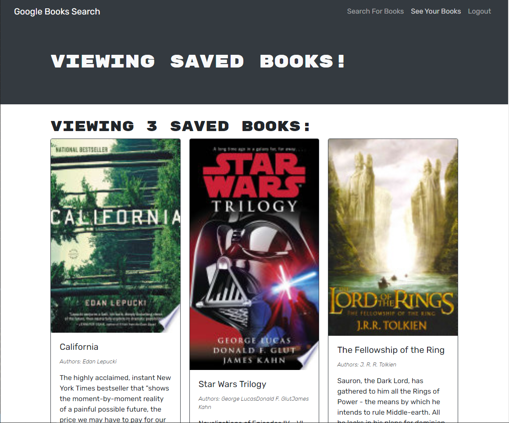

# Book Search Engine

## Description of the Website
This application allows the user to search for books using Google's book search API, and then save them under their personal profile.

 

## Website Features
* Website has individual profile capabilities, so that different users can log in to see their books list.
* Website uses a GraphQL API built with Apollo Server.
* Features different views/options based on whether the user is logged in or not.
* Application is a single-page web application using React.

  
 

## Link to Website
https://uw-book-search-engine.herokuapp.com/

 

## How the Website Looks

 

## Credits

*Project completed by Chris Wein - refactoring starter code replacing RESTful APIs*